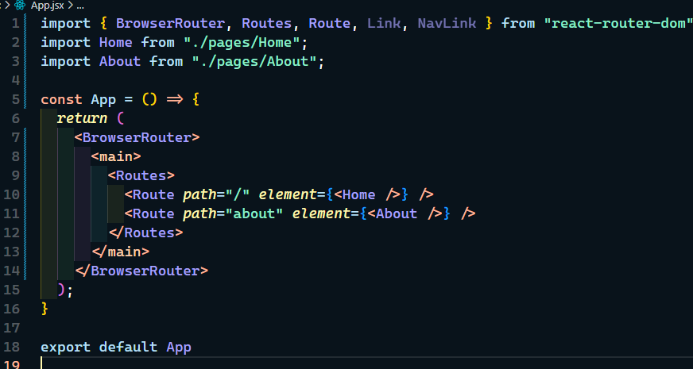
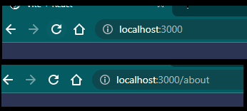
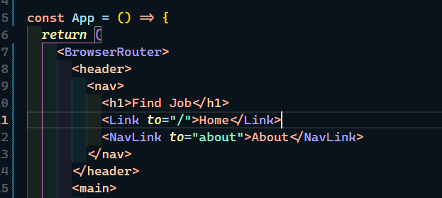
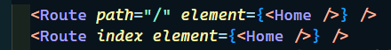
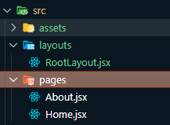
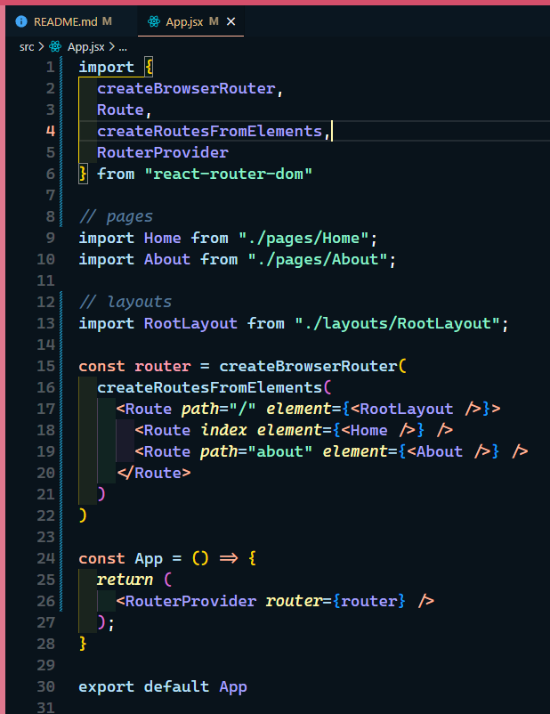
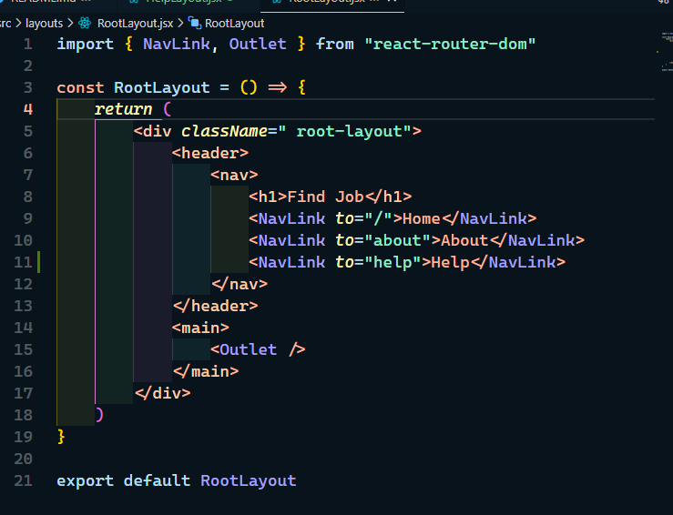
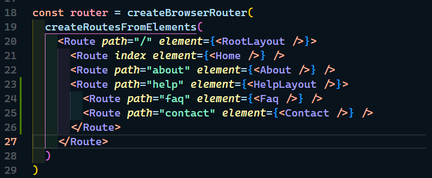
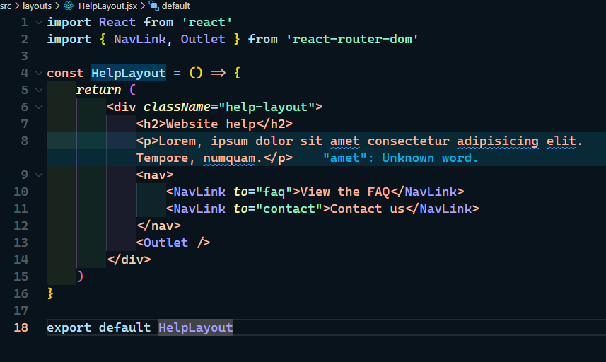

# react-router-D2

---

## install react router latest

**_npm install react-router-dom@latest_**

---

## old way

- now we can use server rendering if we use browser url

- but when we use Link or NavLink we use SPA rendering on client side

- this is the same

- when we use Navlink we get class active - always use NavLink

---

## new way

- instead of Browser router and Routes we will use function createBrowserRouter

<https://reactrouter.com/en/main/routers/picking-a-router>

- in src folder we will have folder for pages and layouts

- import createBrowserRouter
- import createRoutesFromElement
- import RouteProvider
- inside createBrowserRouter we don't use Routes - we use Route
- inside parent route we have path=" / " element={RouteLayout}

- RouteLayout component

---

### Nested routes

- nested routes

- help layout component

- src folder

